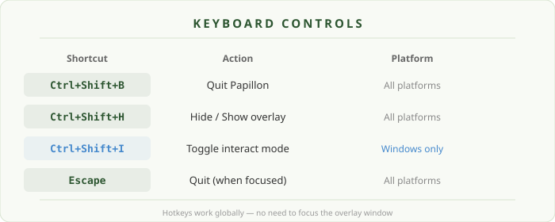
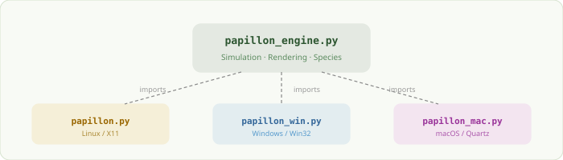

<div align="center">

<picture>
  
</picture>

<br/><br/>

**Beautiful, lifelike butterflies that flutter across your desktop.**<br/>
16 hand-painted species · realistic flight & crawling · Linux, Windows & macOS

<br/>

---

</div>

<br/>

## What is Papillon?

Papillon fills your screen with animated butterflies that cruise, hover, crawl, and react to your mouse. Each species has hand-crafted wing patterns rendered in real-time 3D — from the common Cabbage White to the ultra-rare Luna Moth.

<br/>

<div align="center">
<picture>
  
</picture>
</div>

<br/>

## Species Gallery

| Rarity | Species | Notable Feature |
|:------:|---------|-----------------|
| Common | **Cabbage White** | Soft cream wings with subtle spots |
| Common | **Painted Lady** | Orange and brown patchwork pattern |
| Common | **Monarch** | Iconic orange with black vein network |
| Common | **Common Blue** | Iridescent violet-blue upperwings |
| Uncommon | **Red Admiral** | Bold red-orange bands on dark wings |
| Uncommon | **Tiger Swallowtail** | Yellow wings with black tiger stripes and tails |
| Uncommon | **Fritillary** | Warm orange with intricate checkered spots |
| Uncommon | **Peacock** | Dark wings with vivid blue-purple eyespots |
| Rare | **Blue Morpho** | Brilliant metallic blue iridescence |
| Rare | **Malachite** | Translucent green stained-glass pattern |
| Rare | **Glasswing** | Nearly transparent wings with delicate borders |
| Rare | **Clipper** | Pale blue with bold dark vein pattern |
| Ultra-Rare | **Birdwing** | Massive green and gold wings |
| Ultra-Rare | **Sunset Moth** | Rainbow bands — feathered moth antennae |
| Ultra-Rare | **Eighty-Eight** | Graphic black-and-white "88" pattern on red |
| Ultra-Rare | **Luna Moth** | Pale green with long trailing tails |

<br/>

---

<br/>

## Installation

### Option 1 — Download Pre-built Binary (Easiest)

Go to **[Releases](../../releases)** and download the binary for your platform:

| Platform | File | Run |
|:--------:|------|-----|
| Linux | `Papillon-Linux` | `chmod +x Papillon-Linux && ./Papillon-Linux` |
| Windows | `Papillon-Windows.exe` | Double-click, or run from terminal |
| macOS | `Papillon-macOS` | `chmod +x Papillon-macOS && ./Papillon-macOS` |

<br/>

### Option 2 — Run from Source

#### Prerequisites

- **Python 3.8+**
- **PyQt5** and **NumPy**
- Platform-specific dependencies (see below)

<br/>

<details>
<summary><b>Linux (Ubuntu / Debian)</b></summary>

<br/>

```bash
# Install system dependencies
sudo apt-get install python3-pip libxcb-xinerama0 libxkbcommon-x11-0

# Clone and set up
git clone https://github.com/AeroStarCreations/butterfly_app.git
cd butterfly_app
python3 -m venv venv
source venv/bin/activate
pip install PyQt5 python-xlib numpy

# Run
python3 papillon.py
```

**Optional — install as desktop app:**

```bash
./install.sh
```

This creates a `.desktop` entry so Papillon appears in your application menu.

</details>

<details>
<summary><b>Windows</b></summary>

<br/>

```powershell
# Clone and set up
git clone https://github.com/AeroStarCreations/butterfly_app.git
cd butterfly_app
python -m venv venv
.\venv\Scripts\activate
pip install PyQt5 numpy

# Run
python papillon_win.py
```

</details>

<details>
<summary><b>macOS</b></summary>

<br/>

```bash
# Clone and set up
git clone https://github.com/AeroStarCreations/butterfly_app.git
cd butterfly_app
python3 -m venv venv
source venv/bin/activate
pip install PyQt5 numpy pyobjc-framework-Quartz

# Run
python3 papillon_mac.py
```

> **Note:** macOS requires **Accessibility permission** for global hotkeys.
> Grant it in **System Settings > Privacy & Security > Accessibility**.

</details>

<br/>

---

<br/>

## Keyboard Controls

<div align="center">
<picture>
  
</picture>
</div>

<br/>

| Shortcut | Action | Platform |
|:--------:|--------|:--------:|
| `Ctrl+Shift+B` | Quit Papillon | All |
| `Ctrl+Shift+H` | Hide / Show overlay | All |
| `Ctrl+Shift+I` | Toggle interact mode | Windows only |
| `Escape` | Quit (when window focused) | All |

> **Windows note:** The overlay is click-through by default. Press `Ctrl+Shift+I` to enter **interact mode**, which lets you click on butterflies. Press again to return to click-through.

> **Linux & macOS:** Butterflies are always interactive — click to grab, drag to toss, and watch them fly away!

<br/>

---

<br/>

## How It Works

<div align="center">
<picture>
  
</picture>
</div>

<br/>

The codebase is modular:

- **`papillon_engine.py`** — The shared core (~1850 lines). Contains all 16 species definitions, 7 wing path templates, 16 paint functions, the 3D point-cloud renderer, the `Butterfly` state machine (cruise, hover, crawl, go), and all drawing utilities.

- **Platform launchers** (~300–370 lines each) — Each file imports the engine and adds only its platform-specific overlay: click-through behavior, hotkey registration, and input region management.

| Feature | Linux | Windows | macOS |
|---------|:-----:|:-------:|:-----:|
| Click-through | X11 Shape extension | `WS_EX_TRANSPARENT` | `QRegion.setMask()` |
| Global hotkeys | X11 `grab_key` | Win32 `RegisterHotKey` | Quartz `CGEventTap` |
| Interact mode | Always on | Toggle with `Ctrl+Shift+I` | Always on |

<br/>

---

<br/>

## Butterfly Behaviors

Butterflies follow a natural state machine:

```
         ┌──────────┐
    ┌───>│  Cruise   │───── random turn ─────┐
    │    └────┬─────┘                        │
    │         │ timer expires                │
    │         v                              │
    │    ┌──────────┐                        │
    │    │  Hover    │                        │
    │    └────┬─────┘                        │
    │         │                              │
    │    35%  │  65%                          │
    │    ┌────┴────┐                         │
    │    v         v                         │
    │ ┌────────┐ ┌────────┐                  │
    │ │ Crawl  │ │   Go   │──────────────────┘
    │ └───┬────┘ └────────┘
    │     │ timer expires
    └─────┘
```

- **Cruise** — Smooth flight with gentle turns
- **Hover** — Slows down, stays in an area
- **Crawl** — Wings mostly closed, legs visible, walks slowly with pauses and occasional wing flutter
- **Go** — Picks a direction and flies off, then returns to cruising

Butterflies also react to your mouse — they scatter away from the cursor!

<br/>

---

<br/>

## Building from Source (PyInstaller)

To create standalone binaries yourself:

```bash
pip install pyinstaller

# Linux
pyinstaller --onefile --noconsole \
  --name Papillon-Linux \
  --hidden-import PyQt5.sip \
  --hidden-import papillon_engine \
  papillon.py

# Windows (PowerShell)
pyinstaller --onefile --noconsole `
  --name Papillon-Windows `
  --hidden-import PyQt5.sip `
  --hidden-import papillon_engine `
  papillon_win.py

# macOS
pyinstaller --onefile --noconsole \
  --name Papillon-macOS \
  --hidden-import PyQt5.sip \
  --hidden-import papillon_engine \
  papillon_mac.py
```

Binaries appear in the `dist/` folder.

<br/>

---

<br/>

## Troubleshooting

| Issue | Solution |
|-------|----------|
| **Butterflies don't appear** | Make sure your compositor supports transparent windows |
| **Can't click through on Linux** | Install `python-xlib`: `pip install python-xlib` |
| **macOS hotkeys not working** | Grant Accessibility permission in System Settings > Privacy & Security |
| **Windows overlay blocks clicks** | Press `Ctrl+Shift+I` to toggle interact mode off |
| **High CPU usage** | Close other overlay apps; Papillon targets 60 FPS with up to 8 butterflies |

<br/>

---

<br/>

<div align="center">

<picture>
  
</picture>

<br/>

<sub>Wing geometry adapted from the Papillon CodePen by Pink Pixel (Apache-2.0)</sub>

</div>
